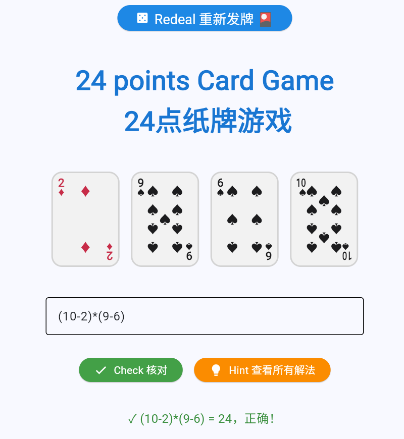

# Twenty-Four Card Game (24 Points)

A 24-point card game built with Python + Flet. Deal 4 random cards, enter an arithmetic expression, and the system will automatically verify whether the numbers match the cards and whether the result equals 24. You can also view all possible solutions with one click.

## Features

- 🎴 **Random Deal** — Deal 4 cards each round (ranks 1–10, with 1 displayed as "A")
- ⌨️ **Expression Input** — Enter your formula, e.g. `(9-8)*8*3`
- ✅ **Auto Verification** — Checks that the numbers used match the dealt cards and the result equals 24
- 💡 **All Solutions** — Click the "Hint" button to enumerate every valid solution (brute-force with deduplication)
- 🔁 **Redeal** — Get a new set of cards at any time

## Requirements

- Python 3.12+
- Flet 0.86.x

## Installation

```bash
pip install flet
```

## Running

```bash
python twentyfour_card_game.py
```

The game will open in your default web browser.

## How to Play

1. Click **"Click here to start 24 points card game"** to deal the first hand.
2. Enter your expression in the input field (use `A` as 1, e.g. `(9-8)*8*3`).
3. Click **"Check"** to verify your answer.
4. Click **"Hint"** to see all valid solutions.
5. Click **"Redeal"** to start a new round.

## Core Algorithm

### `solve_24(ranks)`

The solver performs an exhaustive search:

- **Permutations** — all 4! = 24 permutations of the four numbers
- **Operators** — all 4³ = 64 combinations of the operators `+`, `-`, `*`, `/`
- **Bracket Structures** — 5 distinct parenthesization patterns:
  - `(a ? b) ? (c ? d)`
  - `((a ? b) ? c) ? d`
  - `a ? (b ? (c ? d))`
  - `(a ? (b ? c)) ? d`
  - `a ? ((b ? c) ? d)`

Expressions evaluating to 24 (within floating-point tolerance) are collected and deduplicated via `sorted(set(solutions))`.

### `verify_solution(expr, ranks)`

Validates the player's input by checking:

1. **Character whitelist** — only digits, `+`, `-`, `*`, `/`, `(`, `)`, and spaces are allowed
2. **Number count** — exactly 4 numbers must be used
3. **Number match** — the multiset of numbers must match the dealt cards
4. **Result check** — the expression must evaluate to 24 (with floating-point tolerance)

## Card Rendering

The card face rendering is inspired by the [52CardEngine](https://github.com/Xerako/52CardEngine) card layout scheme:

- Uses the color scheme defined in its `settings.py`
- Fixes the mismatched suit-symbol-to-rank issue from the original 52CardEngine
- Optimized overall rendering quality

Each card displays:

- **Corner markers** — rank label (A–10) and suit symbol
- **Pip grid** — suit symbols arranged in a 3-column × 7-row layout, with positions defined for each rank from 1 to 10

## Project Structure

```
.
├── twentyfour_card_game.py   # Main game program
└── README.md                      # Project documentation
```

## License

MIT License — free to use, modify, and distribute.